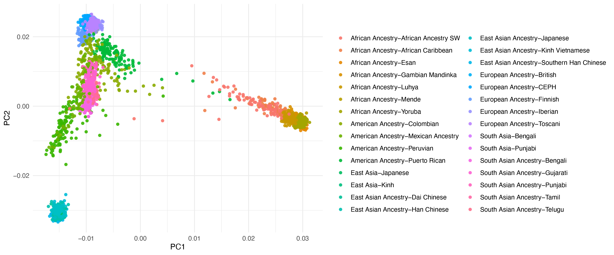

# Genetic Ancestry

<small>Image source: [Council of State Archivists](https://www.statearchivists.org/blogs/anne-ackerson/2022/01/05/why-participate-in-the-cultural-competency-survey)</small>

A detailed workflow to compute and visualize the principal component analysis (PCA) of genotypic Single Nucleotide Polymorphisms (SNPs). The workflow leverages a curated set of [10,000 SNPs predefined by GRAF](https://github.com/ncbi/graf) to pinpoint ancestry markers. For the computation of PCA, we employ [PLINK](https://www.cog-genomics.org/plink/) for generating the eigenvectors and eigenvalues.

## Workflow Overview
1. [**Fingerprinting SNPs Extraction**](retrieve-ancteral-snps.md): Extract GRAF's 10,000 curated SNPs from the dbSNP database.
2. **Data Cleaning**: Ensure the extracted SNPs are exclusively biallelic. (included in the previous notebook)
3. [**SNPs Retrieval from 1,000 Genomes Project**](extract-ancestral-snps-from-1kGP.ipynb): Extract the genotypes of 10,000 fingerprinting positions from the 1,000 Genomes Project's VCF dataset.
4. [**PCA Computation**](compute-1kGP-pca.ipynb): Generate PCA's eigenvectors and eigenvalues using PLINK.
5. [**PCA Visualization**](plot-1kGP-pca.md): Visualize the PCA data, highlighting the relationships between samples using R.

