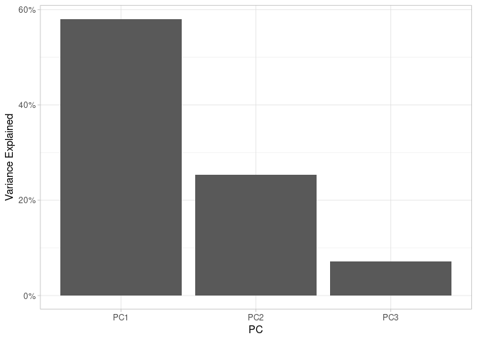
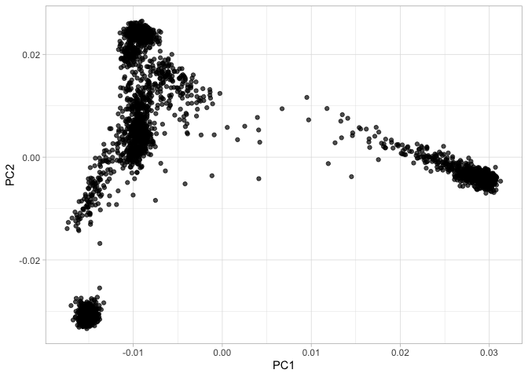

Plot Principal Component Analysis (PCA) of 1kGP
================
Ahmed Moustafa
23 August, 2023 11:04 +0300

## Loading Libraries

``` r
library(tidyverse)
library(tidylog)
```

## Data Loading: Eigenvalues

``` r
# Load the eigenvalues
eigenval = read_tsv("working/1kGP_pca.eigenval", col_names = c("value"))
```

    ## Rows: 10 Columns: 1
    ## ── Column specification ────────────────────────────────────────────────────────
    ## Delimiter: "\t"
    ## dbl (1): value
    ## 
    ## ℹ Use `spec()` to retrieve the full column specification for this data.
    ## ℹ Specify the column types or set `show_col_types = FALSE` to quiet this message.

``` r
head(eigenval)
```

    ## # A tibble: 6 × 1
    ##    value
    ##    <dbl>
    ## 1 347.  
    ## 2 151.  
    ## 3  42.6 
    ## 4  31.4 
    ## 5   5.56
    ## 6   5.19

## Calculating Variance Explained by Each Principal Component

``` r
variance_explained = tibble(pc = paste0("PC", 1:nrow(eigenval)), var = eigenval$value / sum(eigenval))
head(variance_explained)
```

    ## # A tibble: 6 × 2
    ##   pc        var
    ##   <chr>   <dbl>
    ## 1 PC1   0.581  
    ## 2 PC2   0.253  
    ## 3 PC3   0.0713 
    ## 4 PC4   0.0526 
    ## 5 PC5   0.00930
    ## 6 PC6   0.00868

## Plotting the Variance Explained by Principal Components

``` r
ggplot(variance_explained %>% top_n(3)) + 
  geom_bar(aes(x = pc, y = var), stat = "identity") + 
  theme_light() +
  labs (x = "PC", y = "Variance Explained") +
  scale_y_continuous(labels = scales::percent)
```

    ## Selecting by var
    ## top_n: removed 7 rows (70%), 3 rows remaining

<!-- -->

## Data Loading: Eigenvectors

``` r
# Load the eigenvectors
eigenvec = read.table("working/1kGP_pca.eigenvec", sep = " ")
dim(eigenvec)
```

    ## [1] 3202   12

``` r
# Display the first few rows of the PCA data to inspect the structure
head(eigenvec)
```

    ##        V1      V2          V3        V4          V5        V6           V7
    ## 1 HG00096 HG00096 -0.00979116 0.0246988  0.00300170 0.0175045 -0.000177201
    ## 2 HG00097 HG00097 -0.00860299 0.0246735  0.00216549 0.0173607 -0.005536730
    ## 3 HG00099 HG00099 -0.00940134 0.0242093  0.00428509 0.0207030 -0.007276840
    ## 4 HG00100 HG00100 -0.00974342 0.0227575 -0.00062867 0.0176841 -0.008215210
    ## 5 HG00101 HG00101 -0.00949396 0.0236118  0.00404194 0.0183175  0.000795819
    ## 6 HG00102 HG00102 -0.01004650 0.0232639  0.00285737 0.0144682 -0.001366250
    ##            V8          V9          V10          V11         V12
    ## 1 -0.02154430 -0.00710697  4.00740e-03 -0.011880200 -0.00355934
    ## 2  0.00307645 -0.00263790  9.36712e-05  0.007745490  0.00669956
    ## 3 -0.01732370 -0.00154378 -4.40629e-03 -0.004739370  0.00448401
    ## 4 -0.01135090 -0.00653149  4.08700e-04 -0.004569230 -0.00936117
    ## 5 -0.01490100 -0.00882091  7.70109e-03  0.002463610  0.02843140
    ## 6 -0.01884990  0.00368535 -1.34158e-02 -0.000063343 -0.00326615

``` r
pca = tibble(sample = eigenvec$V1, PC1 = eigenvec$V3, PC2 = eigenvec$V4, PC3 = eigenvec$V5)
head(pca)
```

    ## # A tibble: 6 × 4
    ##   sample       PC1    PC2       PC3
    ##   <chr>      <dbl>  <dbl>     <dbl>
    ## 1 HG00096 -0.00979 0.0247  0.00300 
    ## 2 HG00097 -0.00860 0.0247  0.00217 
    ## 3 HG00099 -0.00940 0.0242  0.00429 
    ## 4 HG00100 -0.00974 0.0228 -0.000629
    ## 5 HG00101 -0.00949 0.0236  0.00404 
    ## 6 HG00102 -0.0100  0.0233  0.00286

## Plotting PCA: Visualization of Population Structure

``` r
ggplot(pca) + 
  geom_jitter(aes(x = PC1, y = PC2), alpha = 0.7) + 
  theme_light()
```

<!-- -->

## Enhancing the PCA Plot: Color by Population

``` r
samples = read_tsv("data/populations.tsv")
```

    ## Rows: 4978 Columns: 7
    ## ── Column specification ────────────────────────────────────────────────────────
    ## Delimiter: "\t"
    ## chr (7): sample, sex, biosample, population, population_name, superpopulatio...
    ## 
    ## ℹ Use `spec()` to retrieve the full column specification for this data.
    ## ℹ Specify the column types or set `show_col_types = FALSE` to quiet this message.

``` r
head(samples)
```

    ## # A tibble: 6 × 7
    ##   sample  sex    biosample   population population_name superpopulation
    ##   <chr>   <chr>  <chr>       <chr>      <chr>           <chr>          
    ## 1 HG00271 male   SAME123417  FIN        Finnish         EUR            
    ## 2 HG00276 female SAME123424  FIN        Finnish         EUR            
    ## 3 HG00288 female SAME1839246 FIN        Finnish         EUR            
    ## 4 HG00290 male   SAME1839057 FIN        Finnish         EUR            
    ## 5 HG00303 male   SAME1840115 FIN        Finnish         EUR            
    ## 6 HG00308 male   SAME124161  FIN        Finnish         EUR            
    ## # ℹ 1 more variable: superpopulation_name <chr>

``` r
pca2 = pca %>% inner_join(samples)
```

    ## Joining with `by = join_by(sample)`
    ## inner_join: added 6 columns (sex, biosample, population, population_name,
    ## superpopulation, …)
    ## > rows only in x ( 0)
    ## > rows only in y (1,776)
    ## > matched rows 3,202
    ## > =======
    ## > rows total 3,202

``` r
head(pca2)
```

    ## # A tibble: 6 × 10
    ##   sample       PC1    PC2       PC3 sex    biosample  population population_name
    ##   <chr>      <dbl>  <dbl>     <dbl> <chr>  <chr>      <chr>      <chr>          
    ## 1 HG00096 -0.00979 0.0247  0.00300  male   SAME123268 GBR        British        
    ## 2 HG00097 -0.00860 0.0247  0.00217  female SAME123267 GBR        British        
    ## 3 HG00099 -0.00940 0.0242  0.00429  female SAME123271 GBR        British        
    ## 4 HG00100 -0.00974 0.0228 -0.000629 female SAME125154 GBR        British        
    ## 5 HG00101 -0.00949 0.0236  0.00404  male   SAME125153 GBR        British        
    ## 6 HG00102 -0.0100  0.0233  0.00286  female SAME123945 GBR        British        
    ## # ℹ 2 more variables: superpopulation <chr>, superpopulation_name <chr>

``` r
ggplot(pca2) + 
  geom_jitter(aes(x = PC1, y = PC2, color = superpopulation), alpha = 0.7) + 
  theme_light()
```

<!-- -->

``` r
ggplot(pca2) + 
  geom_jitter(aes(x = PC1, y = PC2, color = population), alpha = 0.7) + 
  theme_light()
```

<!-- -->

## Session Info

``` r
sessionInfo()
```

    ## R version 4.3.1 (2023-06-16)
    ## Platform: x86_64-pc-linux-gnu (64-bit)
    ## Running under: Ubuntu 22.04.3 LTS
    ## 
    ## Matrix products: default
    ## BLAS:   /usr/lib/x86_64-linux-gnu/blas/libblas.so.3.10.0 
    ## LAPACK: /usr/lib/x86_64-linux-gnu/lapack/liblapack.so.3.10.0
    ## 
    ## locale:
    ##  [1] LC_CTYPE=en_US.UTF-8       LC_NUMERIC=C              
    ##  [3] LC_TIME=en_US.UTF-8        LC_COLLATE=en_US.UTF-8    
    ##  [5] LC_MONETARY=en_US.UTF-8    LC_MESSAGES=en_US.UTF-8   
    ##  [7] LC_PAPER=en_US.UTF-8       LC_NAME=C                 
    ##  [9] LC_ADDRESS=C               LC_TELEPHONE=C            
    ## [11] LC_MEASUREMENT=en_US.UTF-8 LC_IDENTIFICATION=C       
    ## 
    ## time zone: Africa/Cairo
    ## tzcode source: system (glibc)
    ## 
    ## attached base packages:
    ## [1] stats     graphics  grDevices utils     datasets  methods   base     
    ## 
    ## other attached packages:
    ##  [1] tidylog_1.0.2   lubridate_1.9.2 forcats_1.0.0   stringr_1.5.0  
    ##  [5] dplyr_1.1.2     purrr_1.0.2     readr_2.1.4     tidyr_1.3.0    
    ##  [9] tibble_3.2.1    ggplot2_3.4.3   tidyverse_2.0.0
    ## 
    ## loaded via a namespace (and not attached):
    ##  [1] utf8_1.2.3        generics_0.1.3    stringi_1.7.12    hms_1.1.3        
    ##  [5] digest_0.6.33     magrittr_2.0.3    evaluate_0.21     grid_4.3.1       
    ##  [9] timechange_0.2.0  fastmap_1.1.1     fansi_1.0.4       scales_1.2.1     
    ## [13] cli_3.6.1         rlang_1.1.1       crayon_1.5.2      bit64_4.0.5      
    ## [17] munsell_0.5.0     withr_2.5.0       yaml_2.3.7        tools_4.3.1      
    ## [21] parallel_4.3.1    tzdb_0.4.0        colorspace_2.1-0  vctrs_0.6.3      
    ## [25] R6_2.5.1          lifecycle_1.0.3   bit_4.0.5         clisymbols_1.2.0 
    ## [29] vroom_1.6.3       pkgconfig_2.0.3   pillar_1.9.0      gtable_0.3.4     
    ## [33] glue_1.6.2        xfun_0.40         tidyselect_1.2.0  highr_0.10       
    ## [37] rstudioapi_0.15.0 knitr_1.43        farver_2.1.1      htmltools_0.5.6  
    ## [41] rmarkdown_2.24    labeling_0.4.2    compiler_4.3.1
