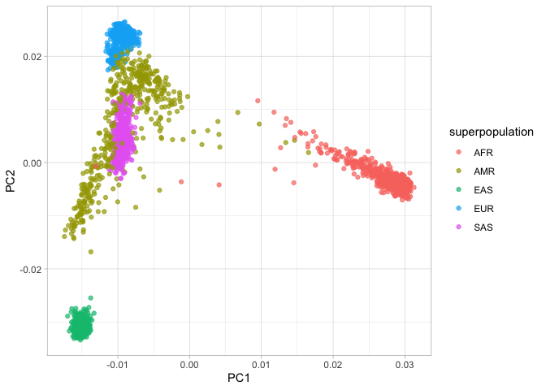
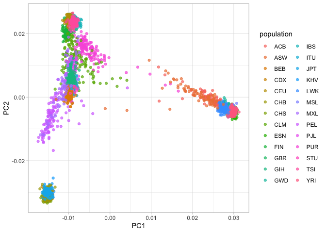
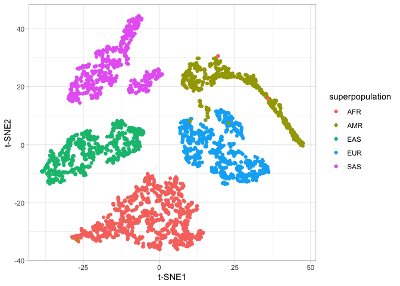
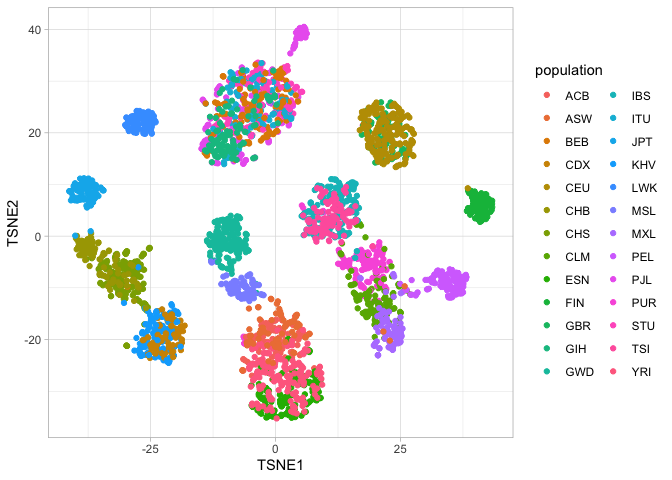
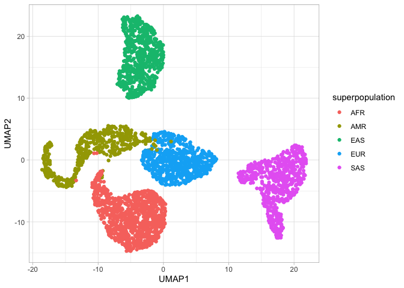
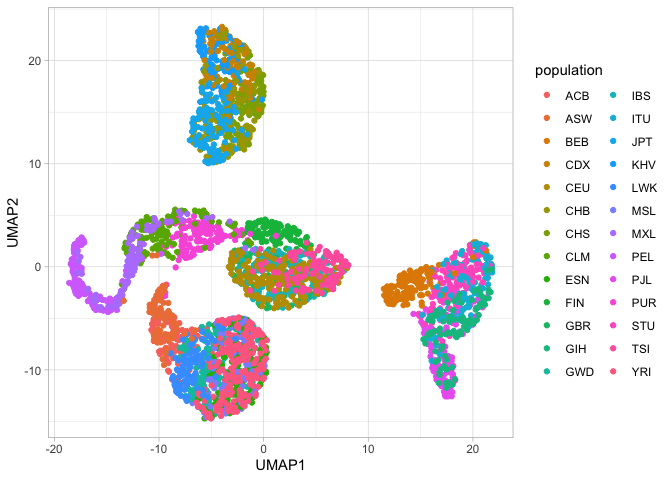

Plot Principal Component Analysis (PCA) of 1kGP
================
Ahmed Moustafa
23 December, 2024 02:05 +0200

## Loading Libraries

``` r
library(tidyverse)
library(tidylog)
library(printr)
library(Rtsne)
library(umap)
```

## Data Loading

### Metadata (populations information)

``` r
samples = read_tsv("data/populations.tsv")
```

    ## Rows: 4978 Columns: 7
    ## ── Column specification ────────────────────────────────────────────────────────
    ## Delimiter: "\t"
    ## chr (7): sample, sex, biosample, population, population_name, superpopulatio...
    ## 
    ## ℹ Use `spec()` to retrieve the full column specification for this data.
    ## ℹ Specify the column types or set `show_col_types = FALSE` to quiet this message.

``` r
head(samples)
```

| sample | sex | biosample | population | population_name | superpopulation | superpopulation_name |
|:---|:---|:---|:---|:---|:---|:---|
| HG00271 | male | SAME123417 | FIN | Finnish | EUR | European Ancestry |
| HG00276 | female | SAME123424 | FIN | Finnish | EUR | European Ancestry |
| HG00288 | female | SAME1839246 | FIN | Finnish | EUR | European Ancestry |
| HG00290 | male | SAME1839057 | FIN | Finnish | EUR | European Ancestry |
| HG00303 | male | SAME1840115 | FIN | Finnish | EUR | European Ancestry |
| HG00308 | male | SAME124161 | FIN | Finnish | EUR | European Ancestry |

### Eigenvalues

``` r
# Load the eigenvalues
eigenval = read_tsv("working/1kGP_pca.eigenval", col_names = c("value"))
```

    ## Rows: 10 Columns: 1
    ## ── Column specification ────────────────────────────────────────────────────────
    ## Delimiter: "\t"
    ## dbl (1): value
    ## 
    ## ℹ Use `spec()` to retrieve the full column specification for this data.
    ## ℹ Specify the column types or set `show_col_types = FALSE` to quiet this message.

``` r
head(eigenval)
```

|     value |
|----------:|
| 346.99400 |
| 151.24600 |
|  42.58400 |
|  31.44490 |
|   5.55535 |
|   5.18856 |

### Eigenvectors

``` r
# Load the eigenvectors
eigenvec = read.table("working/1kGP_pca.eigenvec", sep = " ")
dim(eigenvec)
```

    ## [1] 3202   12

``` r
# Display the first few rows of the PCA data to inspect the structure
head(eigenvec)
```

| V1 | V2 | V3 | V4 | V5 | V6 | V7 | V8 | V9 | V10 | V11 | V12 |
|:---|:---|---:|---:|---:|---:|---:|---:|---:|---:|---:|---:|
| HG00096 | HG00096 | -0.0097912 | 0.0246988 | 0.0030017 | 0.0175045 | -0.0001772 | -0.0215443 | -0.0071070 | 0.0040074 | -0.0118802 | -0.0035593 |
| HG00097 | HG00097 | -0.0086030 | 0.0246735 | 0.0021655 | 0.0173607 | -0.0055367 | 0.0030765 | -0.0026379 | 0.0000937 | 0.0077455 | 0.0066996 |
| HG00099 | HG00099 | -0.0094013 | 0.0242093 | 0.0042851 | 0.0207030 | -0.0072768 | -0.0173237 | -0.0015438 | -0.0044063 | -0.0047394 | 0.0044840 |
| HG00100 | HG00100 | -0.0097434 | 0.0227575 | -0.0006287 | 0.0176841 | -0.0082152 | -0.0113509 | -0.0065315 | 0.0004087 | -0.0045692 | -0.0093612 |
| HG00101 | HG00101 | -0.0094940 | 0.0236118 | 0.0040419 | 0.0183175 | 0.0007958 | -0.0149010 | -0.0088209 | 0.0077011 | 0.0024636 | 0.0284314 |
| HG00102 | HG00102 | -0.0100465 | 0.0232639 | 0.0028574 | 0.0144682 | -0.0013663 | -0.0188499 | 0.0036854 | -0.0134158 | -0.0000633 | -0.0032662 |

``` r
pcs = eigenvec[, 3:ncol(eigenvec)]
colnames(pcs) = paste0("PC", 1:ncol(pcs))
rownames(pcs) = eigenvec$V1
head(pcs)
```

|  | PC1 | PC2 | PC3 | PC4 | PC5 | PC6 | PC7 | PC8 | PC9 | PC10 |
|:---|---:|---:|---:|---:|---:|---:|---:|---:|---:|---:|
| HG00096 | -0.0097912 | 0.0246988 | 0.0030017 | 0.0175045 | -0.0001772 | -0.0215443 | -0.0071070 | 0.0040074 | -0.0118802 | -0.0035593 |
| HG00097 | -0.0086030 | 0.0246735 | 0.0021655 | 0.0173607 | -0.0055367 | 0.0030765 | -0.0026379 | 0.0000937 | 0.0077455 | 0.0066996 |
| HG00099 | -0.0094013 | 0.0242093 | 0.0042851 | 0.0207030 | -0.0072768 | -0.0173237 | -0.0015438 | -0.0044063 | -0.0047394 | 0.0044840 |
| HG00100 | -0.0097434 | 0.0227575 | -0.0006287 | 0.0176841 | -0.0082152 | -0.0113509 | -0.0065315 | 0.0004087 | -0.0045692 | -0.0093612 |
| HG00101 | -0.0094940 | 0.0236118 | 0.0040419 | 0.0183175 | 0.0007958 | -0.0149010 | -0.0088209 | 0.0077011 | 0.0024636 | 0.0284314 |
| HG00102 | -0.0100465 | 0.0232639 | 0.0028574 | 0.0144682 | -0.0013663 | -0.0188499 | 0.0036854 | -0.0134158 | -0.0000633 | -0.0032662 |

``` r
pca_df = data.frame(sample = row.names(pcs), pcs) %>% inner_join(samples)
```

    ## Joining with `by = join_by(sample)`
    ## inner_join: added 6 columns (sex, biosample, population, population_name,
    ## superpopulation, …)
    ## > rows only in x ( 0)
    ## > rows only in samples (1,776)
    ## > matched rows 3,202
    ## > =======
    ## > rows total 3,202

``` r
head(pca_df)
```

| sample | PC1 | PC2 | PC3 | PC4 | PC5 | PC6 | PC7 | PC8 | PC9 | PC10 | sex | biosample | population | population_name | superpopulation | superpopulation_name |
|:---|---:|---:|---:|---:|---:|---:|---:|---:|---:|---:|:---|:---|:---|:---|:---|:---|
| HG00096 | -0.0097912 | 0.0246988 | 0.0030017 | 0.0175045 | -0.0001772 | -0.0215443 | -0.0071070 | 0.0040074 | -0.0118802 | -0.0035593 | male | SAME123268 | GBR | British | EUR | European Ancestry |
| HG00097 | -0.0086030 | 0.0246735 | 0.0021655 | 0.0173607 | -0.0055367 | 0.0030765 | -0.0026379 | 0.0000937 | 0.0077455 | 0.0066996 | female | SAME123267 | GBR | British | EUR | European Ancestry |
| HG00099 | -0.0094013 | 0.0242093 | 0.0042851 | 0.0207030 | -0.0072768 | -0.0173237 | -0.0015438 | -0.0044063 | -0.0047394 | 0.0044840 | female | SAME123271 | GBR | British | EUR | European Ancestry |
| HG00100 | -0.0097434 | 0.0227575 | -0.0006287 | 0.0176841 | -0.0082152 | -0.0113509 | -0.0065315 | 0.0004087 | -0.0045692 | -0.0093612 | female | SAME125154 | GBR | British | EUR | European Ancestry |
| HG00101 | -0.0094940 | 0.0236118 | 0.0040419 | 0.0183175 | 0.0007958 | -0.0149010 | -0.0088209 | 0.0077011 | 0.0024636 | 0.0284314 | male | SAME125153 | GBR | British | EUR | European Ancestry |
| HG00102 | -0.0100465 | 0.0232639 | 0.0028574 | 0.0144682 | -0.0013663 | -0.0188499 | 0.0036854 | -0.0134158 | -0.0000633 | -0.0032662 | female | SAME123945 | GBR | British | EUR | European Ancestry |

## Variance Explained

``` r
variance_explained = tibble(pc = paste0("PC", 1:nrow(eigenval)), var = eigenval$value / sum(eigenval))
head(variance_explained)
```

| pc  |       var |
|:----|----------:|
| PC1 | 0.5805956 |
| PC2 | 0.2530671 |
| PC3 | 0.0712522 |
| PC4 | 0.0526141 |
| PC5 | 0.0092953 |
| PC6 | 0.0086816 |

### Plotting the Variance Explained

``` r
ggplot(variance_explained %>% top_n(3)) + 
  geom_bar(aes(x = pc, y = var), stat = "identity") + 
  theme_light() +
  labs (x = "PC", y = "Variance Explained") +
  scale_y_continuous(labels = scales::percent)
```

    ## Selecting by var
    ## top_n: removed 7 rows (70%), 3 rows remaining

<!-- -->

## Visualizing PCA Clustering

### By superpopulation

``` r
ggplot(pca_df) + 
  geom_jitter(aes(x = PC1, y = PC2, color = superpopulation), alpha = 0.7) + 
  theme_light()
```

<!-- -->

### By population

``` r
ggplot(pca_df) + 
  geom_jitter(aes(x = PC1, y = PC2, color = population), alpha = 0.7) + 
  theme_light()
```

<!-- -->

## Alternative Clustering using t-SNE

### Perform t-SNE

``` r
# Perform t-SNE
set.seed(123)  # Set a seed for reproducibility
tsne_result = Rtsne(as.matrix(pcs[,1:3]), dims = 2, perplexity = 30, theta = 0.5, verbose = TRUE)
```

    ## Performing PCA
    ## Read the 3202 x 3 data matrix successfully!
    ## Using no_dims = 2, perplexity = 30.000000, and theta = 0.500000
    ## Computing input similarities...
    ## Building tree...
    ## Done in 0.09 seconds (sparsity = 0.035335)!
    ## Learning embedding...
    ## Iteration 50: error is 79.204083 (50 iterations in 0.16 seconds)
    ## Iteration 100: error is 64.772105 (50 iterations in 0.14 seconds)
    ## Iteration 150: error is 62.385642 (50 iterations in 0.16 seconds)
    ## Iteration 200: error is 61.401533 (50 iterations in 0.16 seconds)
    ## Iteration 250: error is 60.846001 (50 iterations in 0.16 seconds)
    ## Iteration 300: error is 1.500679 (50 iterations in 0.14 seconds)
    ## Iteration 350: error is 1.140660 (50 iterations in 0.15 seconds)
    ## Iteration 400: error is 0.968229 (50 iterations in 0.14 seconds)
    ## Iteration 450: error is 0.873545 (50 iterations in 0.12 seconds)
    ## Iteration 500: error is 0.827076 (50 iterations in 0.12 seconds)
    ## Iteration 550: error is 0.806732 (50 iterations in 0.13 seconds)
    ## Iteration 600: error is 0.790258 (50 iterations in 0.13 seconds)
    ## Iteration 650: error is 0.777408 (50 iterations in 0.13 seconds)
    ## Iteration 700: error is 0.768881 (50 iterations in 0.12 seconds)
    ## Iteration 750: error is 0.760994 (50 iterations in 0.13 seconds)
    ## Iteration 800: error is 0.753550 (50 iterations in 0.12 seconds)
    ## Iteration 850: error is 0.746623 (50 iterations in 0.12 seconds)
    ## Iteration 900: error is 0.739908 (50 iterations in 0.12 seconds)
    ## Iteration 950: error is 0.734250 (50 iterations in 0.13 seconds)
    ## Iteration 1000: error is 0.729056 (50 iterations in 0.13 seconds)
    ## Fitting performed in 2.73 seconds.

``` r
# The results are stored in tsne_result$Y
head(tsne_result$Y)
```

|          |           |
|---------:|----------:|
| 13.45648 | -6.278075 |
| 20.47906 | -9.302024 |
| 11.36764 |  1.970537 |
| 34.88028 | -7.055738 |
| 13.59423 |  1.797826 |
| 20.18693 | -0.624645 |

### Visualizing t-SNE Clustering

``` r
# Create a data frame for plotting
tsne_df = data.frame(TSNE1 = tsne_result$Y[, 1], 
                     TSNE2 = tsne_result$Y[, 2], 
                     sample = rownames(pcs)) %>% inner_join(samples)
```

    ## Joining with `by = join_by(sample)`
    ## inner_join: added 6 columns (sex, biosample, population, population_name,
    ## superpopulation, …)
    ## > rows only in x ( 0)
    ## > rows only in samples (1,776)
    ## > matched rows 3,202
    ## > =======
    ## > rows total 3,202

``` r
head(tsne_df)
```

| TSNE1 | TSNE2 | sample | sex | biosample | population | population_name | superpopulation | superpopulation_name |
|---:|---:|:---|:---|:---|:---|:---|:---|:---|
| 13.45648 | -6.278075 | HG00096 | male | SAME123268 | GBR | British | EUR | European Ancestry |
| 20.47906 | -9.302024 | HG00097 | female | SAME123267 | GBR | British | EUR | European Ancestry |
| 11.36764 | 1.970537 | HG00099 | female | SAME123271 | GBR | British | EUR | European Ancestry |
| 34.88028 | -7.055738 | HG00100 | female | SAME125154 | GBR | British | EUR | European Ancestry |
| 13.59423 | 1.797826 | HG00101 | male | SAME125153 | GBR | British | EUR | European Ancestry |
| 20.18693 | -0.624645 | HG00102 | female | SAME123945 | GBR | British | EUR | European Ancestry |

#### By superpopulation

``` r
ggplot(tsne_df, aes(x = TSNE1, y = TSNE2, color = superpopulation), alpha = 0.7) +
  geom_point() +
  theme_light() +
  labs(x = "t-SNE1", y = "t-SNE2")
```

<!-- -->

#### By population

``` r
ggplot(tsne_df, aes(x = TSNE1, y = TSNE2, color = population), alpha = 0.7) +
  geom_point() +
  theme_light() +
  labs(x = "t-SNE1", y = "t-SNE2")
```

<!-- -->

## Alternative Clustering using UMAP

### Setting UMAP parameters

``` r
# Set parameters for UMAP
umap_config = umap::umap.defaults
umap_config$n_neighbors = 20
umap_config$min_dist = 0.9
umap_config$metric = "euclidean"
```

### Perform UMAP

``` r
# Perform UMAP
set.seed(123)  # Set a seed for reproducibility
umap_result = umap(as.matrix(pcs[, 1:3]), config = umap_config)

# The results are stored in umap_result$layout
head(umap_result$layout)
```

|         |            |            |
|:--------|-----------:|-----------:|
| HG00096 |  1.2041862 | -2.8331560 |
| HG00097 |  3.3251365 | -2.3108645 |
| HG00099 | -0.9658144 | -0.7895916 |
| HG00100 |  6.8363274 |  0.7601992 |
| HG00101 | -0.0701956 | -0.3116174 |
| HG00102 |  1.6608518 |  0.2403880 |

### Visualizing UMAP Clustering

``` r
# Create a data frame for plotting
umap_df = data.frame(UMAP1 = umap_result$layout[, 1], 
                     UMAP2 = umap_result$layout[, 2], 
                     sample = rownames(pcs)) %>% inner_join(samples)
```

    ## Joining with `by = join_by(sample)`
    ## inner_join: added 6 columns (sex, biosample, population, population_name,
    ## superpopulation, …)
    ## > rows only in x ( 0)
    ## > rows only in samples (1,776)
    ## > matched rows 3,202
    ## > =======
    ## > rows total 3,202

``` r
head(umap_df)
```

| UMAP1 | UMAP2 | sample | sex | biosample | population | population_name | superpopulation | superpopulation_name |
|---:|---:|:---|:---|:---|:---|:---|:---|:---|
| 1.2041862 | -2.8331560 | HG00096 | male | SAME123268 | GBR | British | EUR | European Ancestry |
| 3.3251365 | -2.3108645 | HG00097 | female | SAME123267 | GBR | British | EUR | European Ancestry |
| -0.9658144 | -0.7895916 | HG00099 | female | SAME123271 | GBR | British | EUR | European Ancestry |
| 6.8363274 | 0.7601992 | HG00100 | female | SAME125154 | GBR | British | EUR | European Ancestry |
| -0.0701956 | -0.3116174 | HG00101 | male | SAME125153 | GBR | British | EUR | European Ancestry |
| 1.6608518 | 0.2403880 | HG00102 | female | SAME123945 | GBR | British | EUR | European Ancestry |

#### By superpopulation

``` r
# Plot the UMAP results
ggplot(umap_df, aes(x = UMAP1, y = UMAP2, color = superpopulation), alpha = 0.7) +
  geom_point() +
  theme_light() +
  labs(x = "UMAP1", y = "UMAP2")
```

<!-- -->

#### By population

``` r
# Plot the UMAP results
ggplot(umap_df, aes(x = UMAP1, y = UMAP2, color = population), alpha = 0.7) +
  geom_point() +
  theme_light() +
  labs(x = "UMAP1", y = "UMAP2")
```

<!-- -->

## Further Readings

- [Dimensionality Reduction: PCA, t-SNE, and
  UMAP](https://medium.com/@aastha.code/dimensionality-reduction-pca-t-sne-and-umap-41d499da2df2)
- [Seeing data as t-SNE and UMAP
  do](https://pubmed.ncbi.nlm.nih.gov/38789649/)
  \[[pdf](https://www.nature.com/articles/s41592-024-02301-x.pdf)\]

## Session Info

``` r
sessionInfo()
```

    ## R version 4.4.2 (2024-10-31)
    ## Platform: aarch64-apple-darwin24.1.0
    ## Running under: macOS Sequoia 15.2
    ## 
    ## Matrix products: default
    ## BLAS:   /opt/homebrew/Cellar/openblas/0.3.28/lib/libopenblasp-r0.3.28.dylib 
    ## LAPACK: /opt/homebrew/Cellar/r/4.4.2_2/lib/R/lib/libRlapack.dylib;  LAPACK version 3.12.0
    ## 
    ## locale:
    ## [1] en_US.UTF-8/en_US.UTF-8/en_US.UTF-8/C/en_US.UTF-8/en_US.UTF-8
    ## 
    ## time zone: Africa/Cairo
    ## tzcode source: internal
    ## 
    ## attached base packages:
    ## [1] stats     graphics  grDevices utils     datasets  methods   base     
    ## 
    ## other attached packages:
    ##  [1] umap_0.2.10.0   Rtsne_0.17      printr_0.3      tidylog_1.1.0  
    ##  [5] lubridate_1.9.4 forcats_1.0.0   stringr_1.5.1   dplyr_1.1.4    
    ##  [9] purrr_1.0.2     readr_2.1.5     tidyr_1.3.1     tibble_3.2.1   
    ## [13] ggplot2_3.5.1   tidyverse_2.0.0
    ## 
    ## loaded via a namespace (and not attached):
    ##  [1] generics_0.1.3    stringi_1.8.4     lattice_0.22-6    hms_1.1.3        
    ##  [5] digest_0.6.37     magrittr_2.0.3    evaluate_1.0.1    grid_4.4.2       
    ##  [9] timechange_0.3.0  fastmap_1.2.0     jsonlite_1.8.9    Matrix_1.7-1     
    ## [13] RSpectra_0.16-2   scales_1.3.0      cli_3.6.3         crayon_1.5.3     
    ## [17] rlang_1.1.4       bit64_4.5.2       munsell_0.5.1     withr_3.0.2      
    ## [21] yaml_2.3.10       parallel_4.4.2    tools_4.4.2       tzdb_0.4.0       
    ## [25] colorspace_2.1-1  reticulate_1.39.0 png_0.1-8         vctrs_0.6.5      
    ## [29] R6_2.5.1          lifecycle_1.0.4   bit_4.5.0.1       vroom_1.6.5      
    ## [33] clisymbols_1.2.0  pkgconfig_2.0.3   pillar_1.10.0     gtable_0.3.6     
    ## [37] glue_1.7.0        Rcpp_1.0.13       highr_0.11        xfun_0.47        
    ## [41] tidyselect_1.2.1  rstudioapi_0.17.1 knitr_1.48        farver_2.1.2     
    ## [45] htmltools_0.5.8.1 labeling_0.4.3    rmarkdown_2.28    compiler_4.4.2   
    ## [49] askpass_1.2.1     openssl_2.3.0
